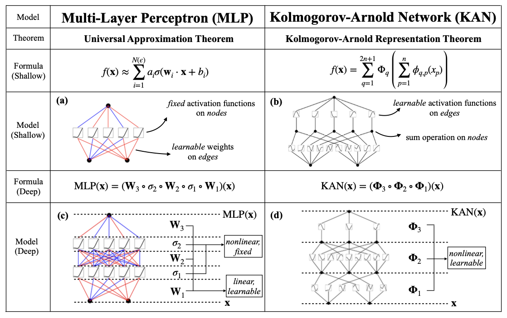

# KAN

This directory contains the implementation of the Kolmogorov-Arnold Networks (KAN) for the [CTF for Science](https://github.com/CTF-for-Science) framework. 
Note: this is the not official code repository of the paper *KAN: Kolmogorov-Arnold Networks* [arXiv link](https://arxiv.org/abs/2404.19756). The official repository can be found here: https://github.com/KindXiaoming/pykan

Kolmogorov-Arnold Networks (KAN) are inspired by the Kolmogrov-Arnold representation theorem which states that any multivariate continuous function *f* on a bounded domain can be expressed as a finite composition and addition of univariate continuous functions. KAN incorporates a fully-connected network with learnable activation functions on edges (weights) instead of the traditional fixed activation functions on the nodes. Weight parameters are replaced by univariate functions parametrized as a spline. KANs combine aspects of both multi-layer perceptrons (MLP) and splines, allowing it to accurately learn features to a great accuracy. 

A comparison table from the paper showing the differences and similarties between MLPs and KANs is shown below: 



## Usage
To run the model, use the `run.py` script from the **project root** followed by the path to a configuration file. For example:

```bash
python models/KAN/run.py models/KAN/config/config_Lorenz.yaml        # to train on all pair_ids
python models/KAN/run.py models/KAN/config/config_KS.yaml            # to train on all pair_ids
python models/KAN/run.py models/KAN/config/config_Lorenz_01.yaml     # to train on pair_id == 1

```
To run a hyperparameter optimization on all configuration files found in `tuning_config`, run the following command: 
```bash
python optimize_parameters.py --metric 'score' --mode 'max' --time-budget-hours 2     
```
To run a hyperparameter optimization on a specific configuration file found in `tuning_config`, run the following command: 
```bash
python optimize_parameters.py --metric 'score' --mode 'max' --time-budget-hours 2  --config-path './tuning_config/{config_name}.yaml'   
```


## Files
The following files are used to run the model on any sub-dataset using the hyperparameter configurations determined from baseline testing: 
- `kan_ctf.py`: Contains the `KANctf` class adapted for the CTF framework
- `run.py`: Script that runs the model for any sub-dataset combination
- `config/config_Lorenz_XX.yaml`: Configuration file to run the model on the Lorenz dataset for  `pair_id` (XX)
- `config/config_KS_XX.yaml`: Configuration file to run the model on the Kuramoto–Sivashinsky dataset for  `pair_id` (XX)

The following files arre used to hyperparameter tune the model using `Ray Tune`:
- `kan_ctf.py`: Contains the `KANctf` class adapted for the CTF framework
- `run_opt.py`: Script that runs the model for any sub-dataset combination
- `optimize_parameters.py`: Script for tuning the model hyperparameters
- `tuning_config/config_Lorenz_Official_XX.yaml`: Configuration file to tune the hyperparemters for the Lorez sub-dataset corresponding to  `pair_id` (XX)
- `tuning_config/config_KS_Official_XX.yaml`: Configuration file to tune the hyperparemters for the Kuramoto–Sivashinsky sub-dataset corresponding to  `pair_id` (XX)

## Configuration Files

Configuration files are located in the `models/KAN/config/` directory and specify the dataset, sub-datasets, and method, along with method-specific parameters. Tuning configuration files are located in `models/KAN/tuning_config/` and specify the dataset, subdatasets, and method in addition to ranges for method-specific parameters. 

An example configuration file is shown below: 
```yaml
dataset: 
  name: ODE_Lorenz    # The dataset name (e.g., ODE_Lorenz, PDE_KS)
  pair_id: [1,2]      # Specifies which sub-dataset to run on the model on (1-9)
                      # Can be omitted or set to 'all' to run on all sub-datasets
model:
  name: KAN
  version: 1          # (int)   Version of KAN used (currently only 1 is available) 
  steps: 2000         # (int)   Number of training steps
  pred_window: 1      # (int)   Number of timesteps to predict as output
  lag: 4              # (int)   Number of past timesteps to consider in input
  train_ratio: 0.9    # (float) Train to test ratio (0 to 1) 
  batch: -1           # (float) Batch size, if -1 then full
  lr: 0.001           # (float) Learning rate for optimizer
  optimizer: 'Adam'   # (str)   Optimizer to use for training (Adam or LBFGS)
  base_fun: 'silu'    # (str)   Residual function b(x) for activation function 
                      #         phi(x) = sb_scale * b(x) + sp_scale * spline(x)
  seed: 42            # (int)   Random number generator seed
  grid: 3             # (int)   Number of grid intervals 
  update_grid: True   # (bool)  Update grid regularly before stop_grid_update_step (default -1)
  k: 3                # (int)   The order for piecewise polynomial of spline
  lamb:  0.00001      # (float) Overall penalty strength
  lamb_coef: 0.00001  # (float) Coefficient magnitude penalty strength
  num_neurons: 3      # (int)   Number of neurons in inner layers
  one_d: 2            # (int)   Dimension of first inner layer
  two_d: 2            # (int)   Dimension of second inner layer
  three_d: 3          # (int)   Dimension of third inner layer
  four_d: 2           # (int)   Dimension of fourth inner layer
  five_d: 3           # (int)   Dimension of fifth inner layer

```

## Pre-requisites
- Python 3.9.7 or higher

## Requirements
KAN relies on the following packages lists in `requirements.txt`:
```txt
numpy == 2.2.5
pykan == 0.2.8
torch == 2.7.0
scikit-learn == 1.6.1
pandas == 2.2.3
tqdm == 4.67.1
```
To install all requirements, run the following from the project root: 
```bash
pip install -r requirements.txt
```

If wanting to hyperparemter tune, make sure your environment contains the optional packages by running `pip install -e .[all]` from the top-level `CTF-for-Science` repository.


## Notes from Author of KAN for how to hyperparameter tune

## Advice on hyperparameter tuning
Many intuition about MLPs and other networks may not directly transfer to KANs. So how can I tune the hyperparameters effectively? Here is my general advice based on my experience playing with the problems reported in the paper. Since these problems are relatively small-scale and science-oriented, it is likely that my advice is not suitable to your case. But I want to at least share my experience such that users can have better clues where to start and what to expect from tuning hyperparameters.

* Start from a simple setup (small KAN shape, small grid size, small data, no reguralization `lamb=0`). This is very different from MLP literature, where people by default use widths of order `O(10^2)` or higher. For example, if you have a task with 5 inputs and 1 outputs, I would try something as simple as `KAN(width=[5,1,1], grid=3, k=3)`. If it doesn't work, I would gradually first increase width. If that still doesn't work, I would consider increasing depth. You don't need to be this extreme, if you have better understanding about the complexity of your task.

* Once an acceptable performance is achieved, you could then try refining your KAN (more accurate or more interpretable).

* If you care about accuracy, try grid extention technique. An example is [here](https://kindxiaoming.github.io/pykan/Examples/Example_1_function_fitting.html). But watch out for overfitting, see below.

* If you care about interpretability, try sparsifying the network with, e.g., `model.train(lamb=0.01)`. It would also be advisable to try increasing lamb gradually. After training with sparsification, plot it, if you see some neurons that are obvious useless, you may call `pruned_model = model.prune()` to get the pruned model. You can then further train (either to encourage accuracy or encouarge sparsity), or do symbolic regression.

* I also want to emphasize that accuracy and interpretability (and also parameter efficiency) are not necessarily contradictory, e.g., Figure 2.3 in [our paper](https://arxiv.org/pdf/2404.19756). They can be positively correlated in some cases but in other cases may dispaly some tradeoff. So it would be good not to be greedy and aim for one goal at a time. However, if you have a strong reason why you believe pruning (interpretability) can also help accuracy, you may want to plan ahead, such that even if your end goal is accuracy, you want to push interpretability first. 

* Once you get a quite good result, try increasing data size and have a final run, which should give you even better results!

Disclaimer: Try the simplest thing first is the mindset of physicists, which could be personal/biased but I find this mindset quite effective and make things well-controlled for me. Also, The reason why I tend to choose a small dataset at first is to get faster feedback in the debugging stage (my initial implementation is slow, after all!). The hidden assumption is that a small dataset behaves qualitatively similar to a large dataset, which is not necessarily true in general, but usually true in small-scale problems that I have tried. To know if your data is sufficient, see the next paragraph.

Another thing that would be good to keep in mind is that please constantly checking if your model is in underfitting or overfitting regime. If there is a large gap between train/test losses, you probably want to increase data or reduce model (`grid` is more important than `width`, so first try decreasing `grid`, then `width`). This is also the reason why I'd love to start from simple models to make sure that the model is first in underfitting regime and then gradually expands to the "Goldilocks zone".
